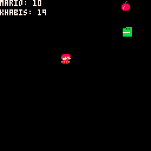
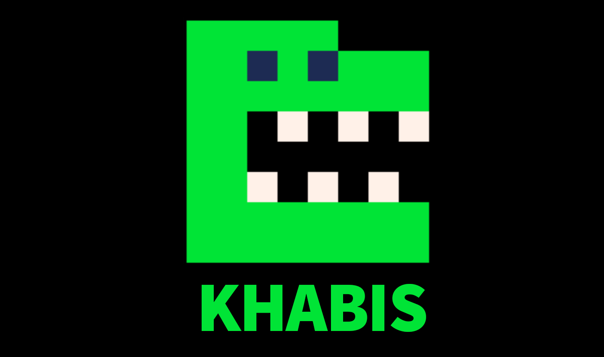

# Mario vs Khabis
Mario vs Khabis   
   

What's up guys   
I made a video to explain how Lua works - in Persian  
and this game is the result  
only in 20min you can make a wonderful game  

## 🎮Play the game online
lexaloffle:   
[▶️Play online](https://www.lexaloffle.com/bbs/?pid=119095#p)   
Github:  
[▶️Play online](https://peymanx.github.io/Mario-vs-Khabis/khabis.html)

In Persian "khabis" means bad guy.   
Khabis and mario try to get fruits and avoid bombs.    
a simple senario and addictive game :)    

#Source Code

Simply move the mario with arrow keys

```lua
      if btn(⬅️) then
            mario.x-=speed
            mario.spr=4				
      end
      if btn(➡️) then
            mario.x+=speed	
            mario.spr=1			
      end

      if btn(⬆️) then
            mario.y-=speed				
      end
      if btn(⬇️) then
            mario.y+=speed				
      end
```

There are 3 main functions `_init()`,`_update()`,`_draw()`

```lua
function _init()
    music(1)
    game_over = false
    -- game config
    bc = 1
    chances= {10,30,50,90}-- in %percent
    bomb_chance= chances[bc]
end

function _update()
    mario.update()
    khabis.update(miveh)

    mario.collision(miveh)
    khabis.collision(miveh)

end

function _draw()
    cls()
    scores()
    khabis.draw()
    
    
    --bomb! or miveh(fruit)
    if bomb.active then
            bomb.draw()
    else
        miveh.draw()				
    end
    
    mario.draw()
end
```


   

Watch the video for full tutorial   
happy coding
